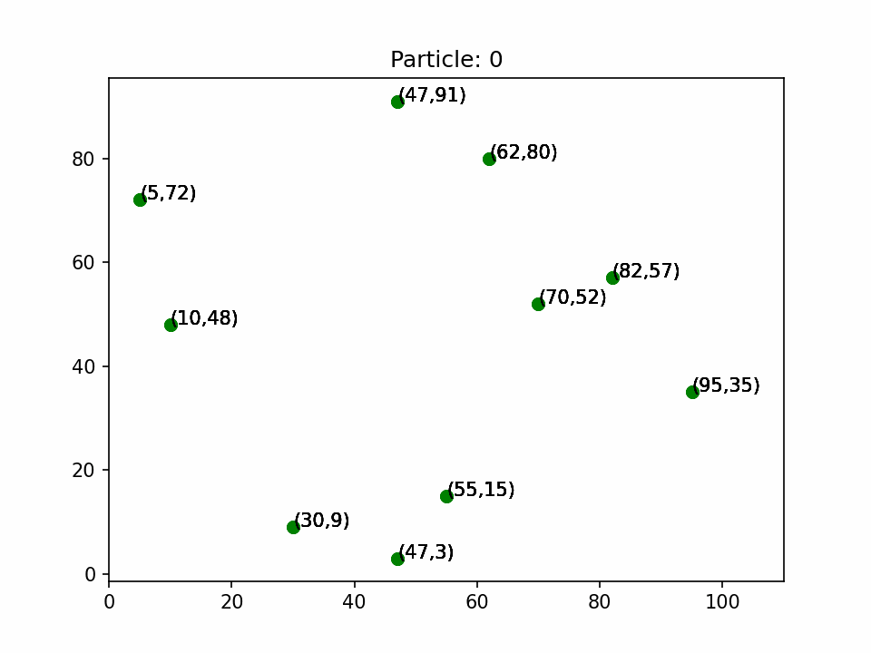
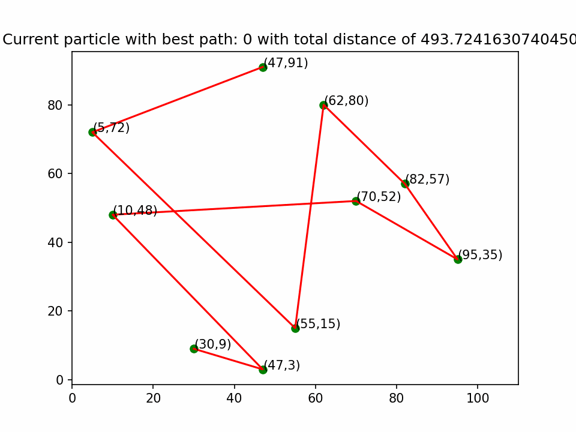
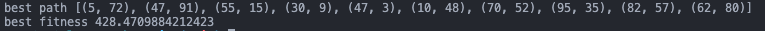

# TSP-Solver-python
An implementation of Particle Swarm Optimization on the Traveling Salesman Problem. This was done as an assignment for COIS-4550.

* Produces a random set of points on a graph (0,100)
* Uses a PSO(Partical Swarm Optimization) algorithm to caluculate the quickest route
* Generates matplotlib animations to visualize the algorithm

### Iteration Animation
<p align="center">
       
</p>

### Current Best Route Animation
<p align="center">
 
 </p>

 ### Coordinates of Best Route
<p align="center">
 
 </p>

## Swarm Intelligence

Swarm intelligence is an AI technique developed from studying real life occurrences. It is easy to about the general idea of swarm intelligence when it is related to an a school of fish. The school of fish has many individuals, isn't under control, but is self-organized as a whole. 

Key characteristics of swarm intelligence:
* Has many individuals
* Doesn't have a controler - decentralized
* Usually consists of 1 type of individual
* Individuals interact with each other and the environment
* Those interactions are what creates a self-organizing system which forms the results

Unique possibilities arise due to the techniques property of forming organized results, while not having a controller. It is a group of simple individuals, that become intelligent as a group. Also, even if a subgroup of individuals fail, the likelyhood of still getting results are still high(robust). 

Disadvantages:
* Sensitive - minor rule change can change alter the entire group
* Hard to predict group results from the individual level
* Difficult to implement and understand

Swarm intelligence has some notable algorithms:
* Ant colony optimization - find best path when moving through routes, record strong positions to simulate pheromones that other ants will migrate to
* Particle swarm optimization - particles move through space, keeping track of its location, the particles best value is stored (fitness value), the best amongst the particles is also stored. Particles change velocity each iteration to head to the best fitness locations.

### Applications
The applications of swarm intelligence include:
* Cargo routing
* Production scheduling 
* Crowd simulation
* Clustering

The future of self-driving will use swarm intelligence. Imagine the cars as the individuals. Seeing traffic and interacting with the environment. This can be shared to other cars creating one big group of traffic data that can be utilized to improve every ones driving. 

## My Implementation of PSO
Following the guide from http://www.swarmintelligence.org/tutorials.php. I was able to implement a PSO, that can find the best route from a list of randomly generated points. I breifly talked about the idea of implementing a PSO, but I will go into more detail here.

Idea:
* Particle keeps track of current location (coordinates)
* Tracks its current best 'fit' of the solution (personalbest)
* The best 'fit' of all the particles is tracked too (globalbest)
* Every iteration, particles will change their velocity towards their personalbest location
* The speed at which this happens is determined by random numbers

#### Examples from Implementation

Say we have the following coords as cities:
```python
cities = [(62, 80), (30, 9), (47, 91), (95, 35), (82, 57), (10, 48), (5, 72), (55, 15), (70, 52), (47, 3)]
```

Boiler-plate code to implement a Particle object:
```python
# Holds the definition of a particle
class Particle:

    def __init__(self, cities):
        self.cities = cities
        self.position = random.sample(cities, len(cities))  # Generate random list
        self.best = self.position.copy()  # Best position is initialized to starting list
        self.fitness = self.fitness()
        self.velocity = [0] * len(self.position)  # Init wilt 0s

    # Formula for distance between 2 points
    def distance(self, city1, city2):
        return math.sqrt((city2[0] - city1[0]) ** 2 + (city2[1] - city1[1]) ** 2)
```
The algorithm calls for the initialization of random particles. Notice that position is initialized to have a random order of the cities. Distance is a function that uses the distance formula to return the distance of points on an x-y plane

The main loop of the PSO is in the following code. For each iteration, look at all the particles, do a fitness test, if that value is less than the current personal best (pbest), then set that value to the pbest, gbest is then the list of the current particles position list. The get_position() function is called which will update velocity and get the new positions.
```python
 # For each particle: calc fitness value
    # If fitness value is better than the best fitness value  set current value to new best
    for i in range(iter):
        for count, p in enumerate(particles):  # Loop through each particle
            if (p.fitness < pbest):
                pbest = p.fitness
                gbest = p.best.copy()
                # gbest.append(p.position[0])  # Add the starting city to the end
            #global_positions[count] = p.best.copy()  # Get all the best routes
            #global_fitness[count] = p.fitness
            p.get_position(gbest, c1, c2)
```

Velocity equation used from the website. Add velocity to x-y coord to set the new position.

```python
def get_position(self, gbest, c1, c2):
        r1 = random.random()
        r2 = random.random()
        for i in range(len(self.position)):
            self.velocity[i] = self.velocity[i] + c1 * r1 * (self.best[i][0] - self.position[i][0]) + c2 * r2 * (
                    gbest[i][0] - self.position[i][0])
            x = self.position[i][0] + self.velocity[i]  # Add velocity to x coord
            y = self.position[i][1] + self.velocity[i]  # Add velocity to y coord
            x = self.limit_check(x)
            y = self.limit_check(y)
            self.position[i] = (x, y)
```

This just loops until all the iterations are complete, leaving us with a final result for best path, and the total distance of that path.

#### Work Cited

Brezočnik, Lucija, et al. “Swarm Intelligence Algorithms for Feature Selection: A Review.” MDPI, Multidisciplinary Digital Publishing Institute, 1 Sept. 2018, https://www.mdpi.com/2076-3417/8/9/1521. 

Dorigo, Marco, and Mauro Birattari. “Swarm Intelligence.” Scholarpedia, http://www.scholarpedia.org/article/Swarm_intelligence. 

Hu, Xiaohui. “Pso Tutorial.” Particle Swarm Optimization: Tutorial, http://www.swarmintelligence.org/tutorials.php. 

Swarm Intelligence, https://www.techferry.com/articles/swarm-intelligence.html#overview. 


